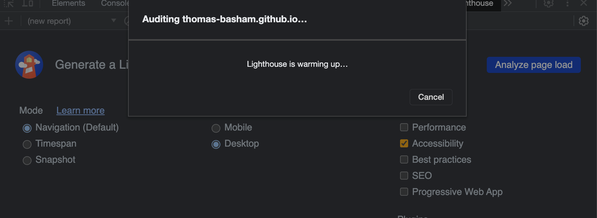

# LAB - 3

## About Me

A webpage about the interests of our class spring-c-201n4

### Authors: Spring-c-201n4

### Links and Resources

* [W3 Schools Box Shadow](https://www.w3schools.com/css/tryit.asp?filename=trycss3_box-shadow)
* [Css Box shadow examples](https://getcssscan.com/css-box-shadow-examples)
* [Coolors](https://coolors.co/)

### Lighthouse Accessibility Report Score

### Reflections and Comments

* Consider including the answers to your daily journal and submission questions here
* This is also a good place to reflect on the tools and resources used and learned